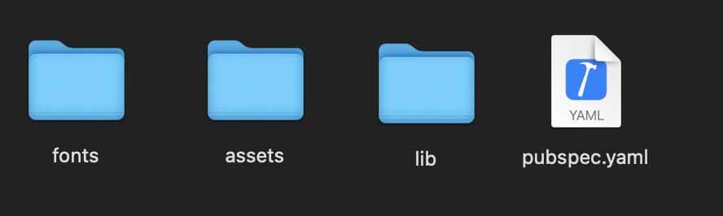
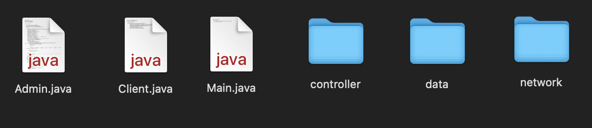

Welcome to the CodeKalak Team Airplane Ticket Shop! This is a Flutter app with a Java backend that allows users to browse and purchase airplane tickets online, similar to Alibaba. We are Aras Valizadeh and Saman Rostambeigi, who are studying at Shahid Beheshti University.

To use the app, simply download and install it on your device. The app is available for both Android and iOS platforms.

Once installed, you can browse available airplane tickets by entering your desired destination and travel dates. The app will display a list of available flights, along with their prices and other relevant information.

To purchase a ticket, select the desired flight and enter your payment details. The app will process the payment and provide you with a confirmation of your purchase.

The CodeKalak Team Airplane Ticket Shop is built using the following technologies:

Flutter: A framework for building native mobile apps for iOS and Android using the Dart programming language.
Java: A popular programming language used for building backend systems, such as the one used in this app.
We welcome contributions from anyone interested in improving the CodeKalak Team Airplane Ticket Shop. To contribute, please fork the repository and submit a pull request with your changes.

In this project, we have provided two parts:

Front-end part (Flutter):
In this repository, you can access the assets and other main files of the Flutter part of the project.

Back-end part (Java):
In this repository, you can access the Java classes that implement a simple database. To achieve this goal, we have used some features like threads, working with files, and Java net.

More details have been gathered in project report .

Contributing
We welcome contributions from anyone who is interested in improving the CodeKalak Team Airplane Ticket Shop. If you would like to contribute, please fork the repository and submit a pull request with your changes.

Enjoy it! :)

